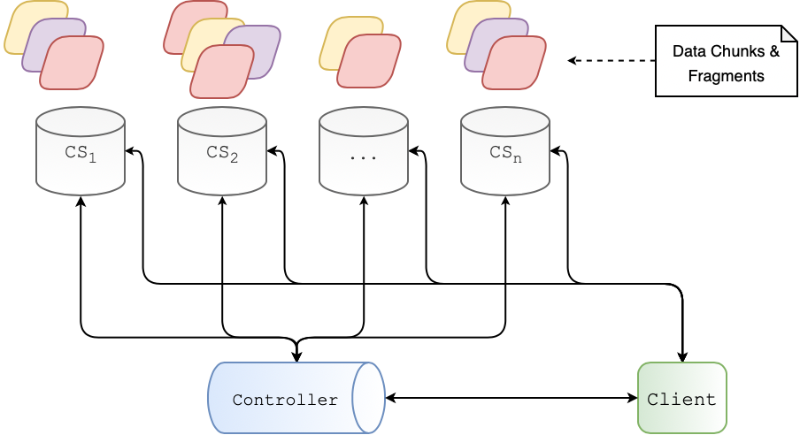

# Distributed Computing

**A Distributed, Replicated, and Fault Tolerant File System: Contrasting Replication and Erasure Coding**

This project introduces a distributed, failure-resilient file system. The fault tolerance for files is achieved using two techniques: replication and erasure coding.

There are three components that this entails:
* *Chunk Server* responsible for managing file chunks. There will be one instance of the chunk server running on each machine.
* A *controller* node for managing information about chunk servers and chunks within the system. There will be only one instance of the controller node.
* *Client* which is responsible for storing, retrieving, and updating files in the system. The client is responsible for splitting a file into chunks and assembling the file back using chunks during retrieval.



### Replications
Every file that will be stored in this file system will be split into 64KB chunks with a replication factor of three. These chunks need to be distributed on a set of available chunk servers. Each 64KB chunk keeps track of its own integrity, by maintaining checksums for 8KB slices of the chunk. The message digest algorithm to be used for computing this checksum is SHA-1. Individual chunks are stored as regular files on under `/tmp` on the host file system under.  

To cope with disk drive failures and tampered files, the chunk servers will perform a validity check to detect corruption. This occurs when a client requests to read a file. If it is detected that a slice of a chunk is corrupted, the other valid replicas of this chunk are contacted and error correction is performed.  

### Heatbeat
Each chunk server will regularly send heartbeats to the controller node. These heartbeats will be split into two:
1. A major heartbeat every 5 minutes
2. A Minor heartbeat every 30 seconds

Major heartbeats will include metadata information about all the chunks maintained at the chunk server. The minor heartbeat will include information about any newly added chunks. Both include information about the total number of chunks and free-space available at the chunk server.

The controller will send regular health checks to each of the chunk servers to detect server failures. In response, the controller contacts chunk servers that hold legitimate copies of the affected chunks and have them send these chunks to designated chunk servers.  

### Erasure Coding
The storage requirements in a replication-based setting increase proportional to the number of replicas. Erasure coding offers an alternative to achieve the same degree of redundancy without the corresponding increase in storage costs.  

In this scheme of erasure coding, individual chunks are broken it into **k** *primary shards*, erasure coded and expanded into **n** *parity shards* using Reed-Solomon algorithm. Thereafter, the fragments are stored across the available chunk servers. Note that **n** must be greater than **k**; furthermore, **m=n-k** is the *degree of redundancy* since any of the **k** fragments can be used to reconstitute the chunk. For the purposes of this assignment, we will work with **k=6** and **m=3**.  

### Configuration
The `conf/` directory holds the application properties and machine lists for starting up all of the chunk servers. These properties include:

```python
# Host the controller is living on ( localhost / jackson )
controller.host=jackson

# Port the controller is living on
controller.port=8189

# Host the client is living on ( localhost )
client.host=lincoln

# Outbound directory for the client read files from ( data/ )
client.outbound.directory=data/

# Fault tolerance schema ( replication / erasure )
system.design.schema=replication
```

When running on a distributed environment, add or remove desired client machines to the application. Each machine should be on a new line and can all be unique or the same.

```console
vim conf/machine_list
```

### Execution
Gradle is used for build automation, and can be executing manually with `gradle clean; gralde build`. The application is constructed within a multi-layer package under `cs555.system`, and can be ran by invoking the JAR as follows:

```console
$ java -cp ./conf/:./build/libs/fault-tolerant-file-system.jar cs555.system.node.Controller

$ java -cp ./conf/:./build/libs/fault-tolerant-file-system.jar cs555.system.node.ChunkServer

$ java -cp ./conf/:./build/libs/fault-tolerant-file-system.jar cs555.system.node.Client
```

#### MacOS
Execute the run script to start the controller.
```console
Jasons-MacBook-Pro:fault-tolerant-file-system stock$ ./osx.sh
```

This will spawn a new terminal, where the `osx.sh` script can be run again to spawn n number of tabs where each chunk server is instantiated.
```console
Jasons-MacBook-Pro:fault-tolerant-file-system stock$ ./osx.sh
```

Thereafter, the client can be started up with the `c` flag, otherwise more chunk servers will be started.
```console
Jasons-MacBook-Pro:fault-tolerant-file-system stock$ ./osx.sh c
```

#### Linux
Execute the run script to start the controller and chunk servers and a single client.  
```console
mars:fault-tolerant-file-system$ ./run.sh
```
